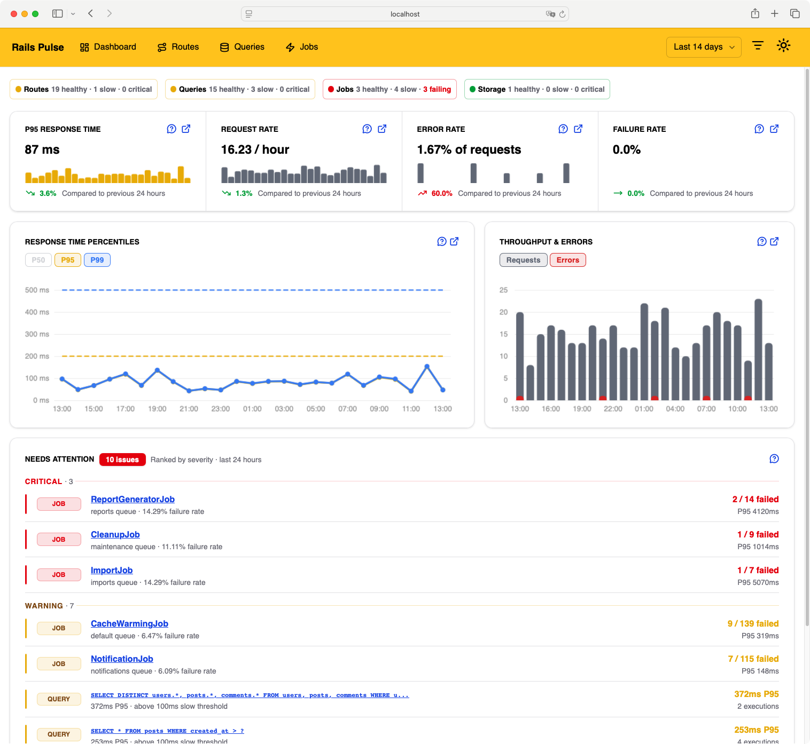
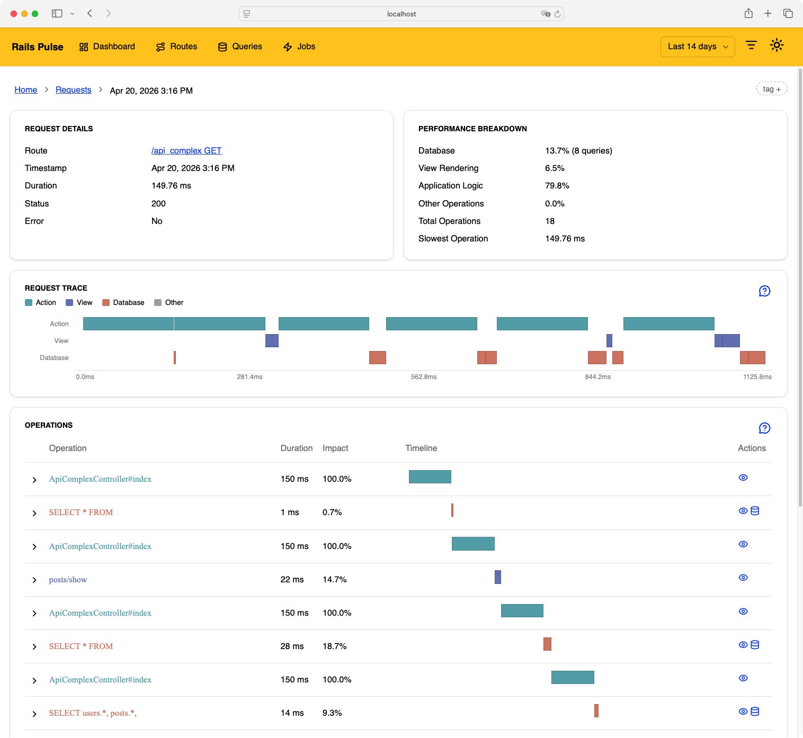
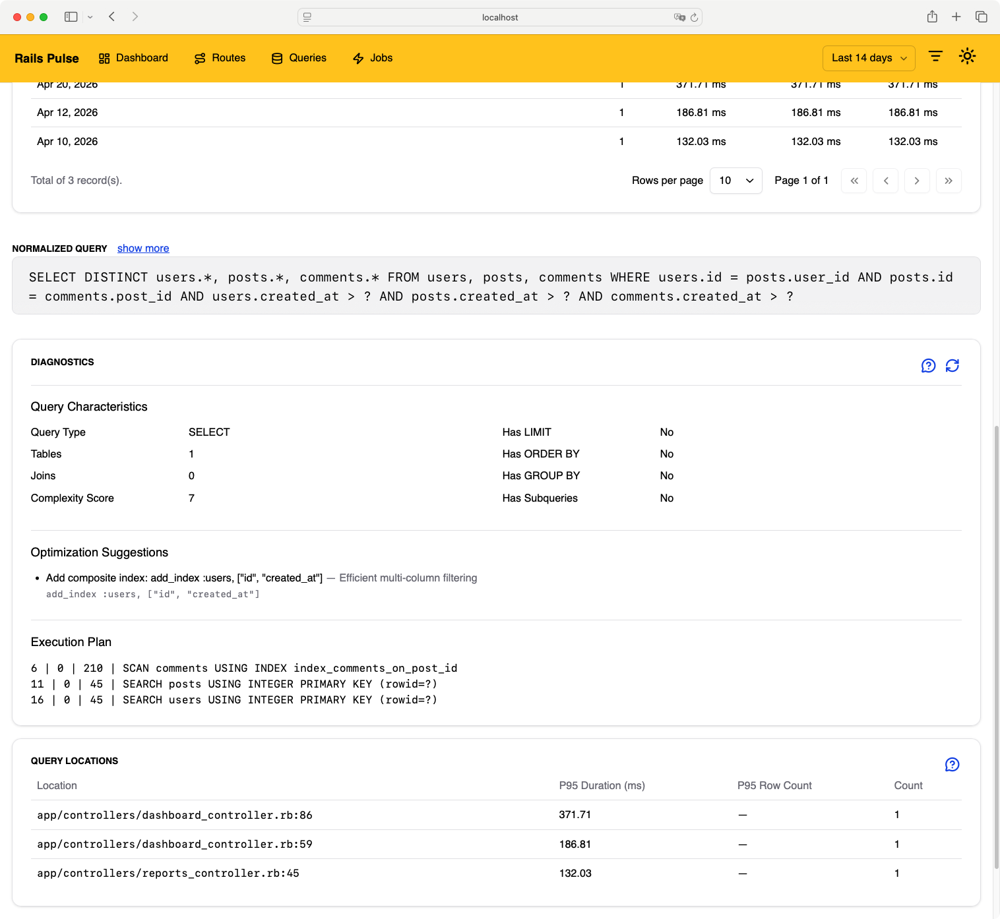
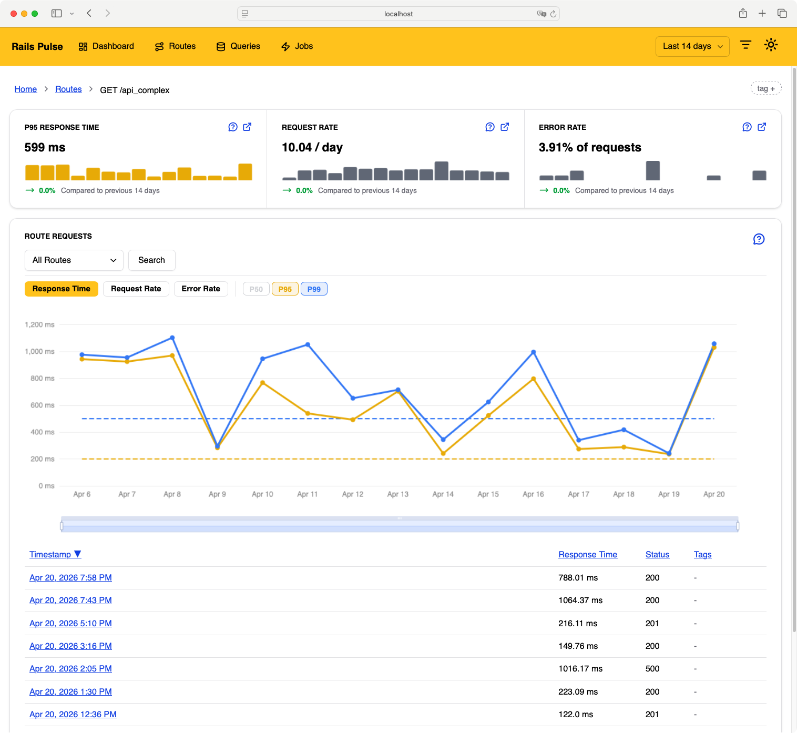

<div align="center">
  
</div>

---

# Rails Pulse

**Self-hosted performance monitoring for Rails apps**


Rails Pulse is a Rails engine that monitors your app's performance from the inside. It tracks slow requests, N+1 queries, SQL performance, background jobs, and unhandled exceptions. All data stays in your own database, no third-party cloud, no SaaS subscription, no data leaving your servers.

<table border="0">
  <tr border="0" style="border:0">
    <td border="0" style="border:0">
    </td>
    <td style="border:0"></td>
  </tr>
  <tr>
    <td style="border:0"></td>
    <td style="border:0"></td>
  </tr>
</table>

## Installation

Add to your Gemfile:

```ruby
gem 'rails_pulse'
```

Run the installer:

```bash
bundle install
rails generate rails_pulse:install
rails db:migrate
```

Mount the dashboard in `config/routes.rb`:

```ruby
Rails.application.routes.draw do
  mount RailsPulse::Engine => "/rails_pulse"
end
```

Schedule the background jobs:

```ruby
RailsPulse::SummaryJob.perform_later  # cron: 5 * * * *
RailsPulse::CleanupJob.perform_later  # cron: 0 1 * * *
```

Your dashboard is now at `http://localhost:3000/rails_pulse`.

Full install guide: [railspulse.com/documentation/installation](https://railspulse.com/documentation/installation)

Separate database setup: [railspulse.com/documentation/database](https://railspulse.com/documentation/database)

## Configuration

Rails Pulse works out of the box with sensible defaults. To customise, edit `config/initializers/rails_pulse.rb`:

```ruby
RailsPulse.configure do |config|
  config.enabled = true

  config.request_thresholds = {
    slow: 700,
    very_slow: 2000,
    critical: 4000
  }

  config.track_jobs = true
  config.capture_job_arguments = false  # keep false to protect sensitive data

  config.track_exceptions = true
  config.capture_exception_params = true  # params are filtered via Rails' filter_parameters

  config.full_retention_period = 30.days
end
```

Full configuration reference: [railspulse.com/documentation/advanced](https://railspulse.com/documentation/advanced)

## Authentication

Rails Pulse has no built-in authentication, you protect the dashboard using your app's existing auth. Add an `authentication_method` to the initializer:

```ruby
RailsPulse.configure do |config|
  config.authentication_enabled = true
  config.authentication_redirect_path = "/login"

  config.authentication_method = proc {
    unless user_signed_in? && current_user.admin?
      redirect_to main_app.root_path, alert: "Access denied"
    end
  }
end
```

Authentication guide: [railspulse.com/documentation/authentication](https://railspulse.com/documentation/authentication)

## Features

- **Request monitoring** — every request is timed and stored with its route, status, SQL count, and duration. Slow requests are flagged automatically based on thresholds you control.
- **Query analysis** — captures the queries behind each request, detects N+1 patterns, and tracks normalized SQL across requests so you can see which queries are hurting you in production, not just in development.
- **Job tracking** — monitors background job duration, queue wait time, and failure rates. Works with any Active Job adapter.
- **Exception tracking** — captures unhandled exceptions from web requests, groups them by class and location, and shows full backtraces with filtered request params. See recurring errors in production without a separate error monitoring service.
- **System health bar** — at-a-glance dashboard summary showing healthy, slow, and critical counts across your routes, queries, jobs, and storage. Lets you see the overall state of your app before drilling into specifics.
- **No data leaves your app** — everything is stored in your own database. No third-party cloud, no SaaS subscription, no outbound connections.
- **Low overhead** — tracking is async and uses a thread-local flag to skip recording Rails Pulse's own internal requests.

## Contributing

Bug reports and pull requests are welcome on [GitHub](https://github.com/railspulse/rails_pulse).

## License

Available as open source under the [MIT License](https://opensource.org/licenses/MIT).
